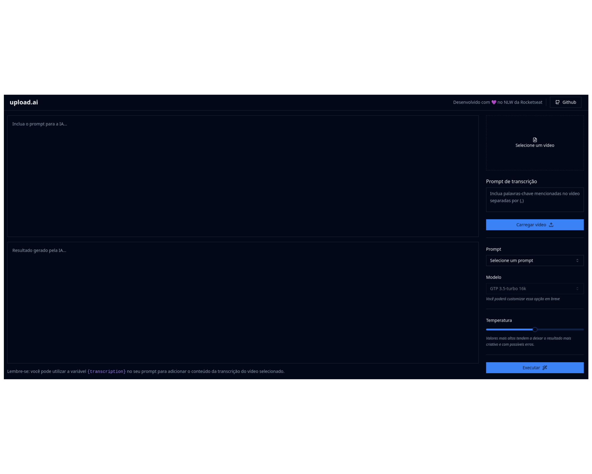

# UI GERADOR DE TÍTULO E DECRIÇÃO DE VÍDEO UTILIZANDO IA


> Esta é uma aplicação desenvolvida no último evento NLW IA da Rockeseat.

<div style="width:100%; display:flex; align-items:center; gap:16px">
    
</div>

## Detalhes do aplicativo

- O aplicativo permite carregar um vídeo, mostrar o preview do vídeo e em seguida faz a conversão de .mp4 para .mp3
para que o contéudo fiquei mais leve para trafegar na rede. Tudo isso no frontend utilizando webassembly. Após essa
conversão, o usuário pode escolher se quer gerar um título ou uma descrição para o vídeo, e utilizando stream a IA
vai preenchendo o campo de acordo com a que vem da api.

## 🚀 Melhorias futuras
- [ ] - Criar mais prompts, como por exemplo: resumo do vídeo.
- [ ] - Inserir testes automátizados
- [ ] - Criar um fluxo de tratamento de erros
- [ ] - Melhorar requisições fazendo uso de uma lib como react query.

## Tecnologias utilizadas

- Tailwindcss (Ferramenta para produtividade na estilização)
- OpenIA (Api para o modelo de IA)
- FFMPEG (Ferramenta para converter vídeo em áudio no navegador)
- Shadcn/UI (Lib de components para melhorar a produtividade)

## 💻 Como usar o projeto
Para utilizar e testar o projeto, esteja em um computador com Node Js instalado e siga as
etapas abaixo:

1 clone o projeto com o comando
```
git clone https://github.com/IgorAlvesR/upload-ai-web
```
2 Acesse o projeto pelo terminal com o comando
```
cd upload-ai-api
```
3 Instale o gestor de pacotes pnpm com o comando
```
npm install -g pnpm
```
4 Instale as dependências necessárias com o comando
```
pnpm install
```
7 Rode o projeto com o comando
```
pnpm run dev
```
8 Acesse o projeto
```
http://localhost:5173
```

## 🌐 Links úteis
[NodeJS](https://nodejs.org/en/download)
[Festify](https://fastify.dev/)
[Tailwind](https://tailwindcss.com/)
[OpenAI](https://platform.openai.com/)
[FFmpeg](https://ffmpegwasm.netlify.app/)
[ShadcnUI](https://ui.shadcn.com/)


## 🧑‍💻 Igor Alves Rodrigues

[](https://www.linkedin.com/in/igor-alves-rodrigues-7941a116b/)
[](https://gthub.com/igoralvesr)
[](http://wa.me/5548998434969)
[](https://igoralvesr.github.io)